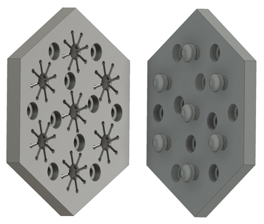
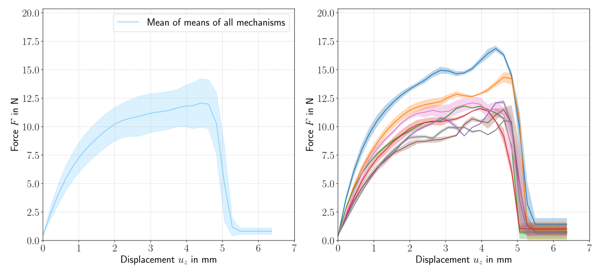
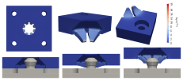

# ShroomLock -  an Interlocking Metasurface Mechanism

  
  

## Introduction
Welcome to the ShroomLock repository! Here, you will find the design files and resources for the interlocking metasurface mechanism known as ShroomLock. SHroomLock is a snapping mechanism which means that it exhibits significant deformation during assembly and disassembly, while experiencing only minor deformation when locked together. Think of it like Lego but different.

## Overview
ShroomLock is composed of two key elements: a pin element and a spring element that are distributed over a surface. The mechanism is highly scalable, making it adaptable to a wide range of surface shapes, while ensuring reliable snapping behavior. One of its unique features is that the entire surface mechanism can be traced back to a single snapping element, which greatly simplifies testing.

## Printing
Here you can find the printing parameters used to print the parts on an Anycubic Vyper 3D printer. We used FLEX HARD 1.75 mm TPU filament from extrudr.

  <table>
    <tr>
      <th>Parameter</th>
      <th>Value/Setting</th>
    </tr>
    <tr>
      <td>Layer Height</td>
      <td>0.1 mm</td>
    </tr>
    <tr>
      <td>Build Plate Temperature</td>
      <td>55 °C</td>
    </tr>
    <tr>
      <td>Line Width</td>
      <td>0.4 mm</td>
    </tr>
    <tr>
      <td>Flow</td>
      <td>103 %</td>
    </tr>
    <tr>
      <td>Wall Thickness</td>
      <td>2.4 mm</td>
    </tr>
    <tr>
      <td>Print Speed</td>
      <td>25.0 mm/s</td>
    </tr>
    <tr>
      <td>Z Seam Alignment</td>
      <td>Random</td>
    </tr>
    <tr>
      <td>Initial Layer Speed</td>
      <td>15.0 mm/s</td>
    </tr>
    <tr>
      <td>Top/Bottom Thickness</td>
      <td>1.5 mm</td>
    </tr>
    <tr>
      <td>Enable Retraction</td>
      <td>☑</td>
    </tr>
    <tr>
      <td>Infill Density</td>
      <td>20.0 %</td>
    </tr>
    <tr>
      <td>Combing Mode</td>
      <td>All</td>
    </tr>
    <tr>
      <td>Infill Pattern</td>
      <td>Gyroid</td>
    </tr>
    <tr>
      <td>Enable Print Cooling</td>
      <td>☑</td>
    </tr>
    <tr>
      <td>Printing Temperature</td>
      <td>215 °C</td>
    </tr>
    <tr>
      <td>Fan Speed</td>
      <td>100 %</td>
    </tr>
    <tr>
      <td>Temperature Initial Layer</td>
      <td>225 °C</td>
    </tr>
    <tr>
      <td>Print Sequence</td>
      <td>One at a Time</td>
    </tr>
  </table>

## Experimental Results

  

We have experimentally examined the force-displacement characteristics of ShroomLock by conducting tests on the unsnapping behavior when pulling a single pin element out of a spring element. The results are shown above, and you can find all the measured data in this repository.

## Numerical Modeling

  

Using [FEniCSx](https://fenicsproject.org/), we performed numerical modeling to further investigate the behavior of ShroomLock. For a detailed explanation of the contact model employed here, refer to [(Bleyer, 2018)](https://comet-fenics.readthedocs.io/en/latest/demo/contact/penalty.html). The repository contains all the necessary code and meshes for the numerical simulations.

## Repository Contents
This repository consists of five folders:
* [data](./data/) which contains all measured data from experimental testing,
* [design](./design/) which contains the printing files in STEP format
* [numerics](./numerics/) which contains meshes and code for the numerical modeling
* [pictures](./pictures/) which contains example pictures for this readme
* [testing](./testing/) which contains the code for evaluating the experimental measurements